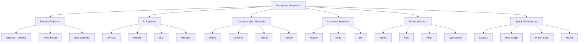

# Global Aerospace & Advanced Technology Industry Map

```mermaid
graph TD

A[Aerospace Integrators]

A --> B[Mobility Platforms]
A --> C[AI Systems]
A --> D[Communication Networks]
A --> E[Advanced Materials]
A --> F[Semiconductors]
A --> G[Space Infrastructure]

B --> B1[Oshkosh Defense]
B --> B2[Rheinmetall]
B --> B3[BAE Systems]

C --> C1[NVIDIA]
C --> C2[Palantir]
C --> C3[IBM]
C --> C4[Microsoft]

D --> D1[Thales]
D --> D2[L3Harris]
D --> D3[Viasat]
D --> D4[Iridium]

E --> E1[Hexcel]
E --> E2[Toray]
E --> E3[3M]

F --> F1[TSMC]
F --> F2[Intel]
F --> F3[AMD]
F --> F4[Qualcomm]

G --> G1[SpaceX]
G --> G2[Blue Origin]
G --> G3[Planet Labs]
G --> G4[Maxar]
```
